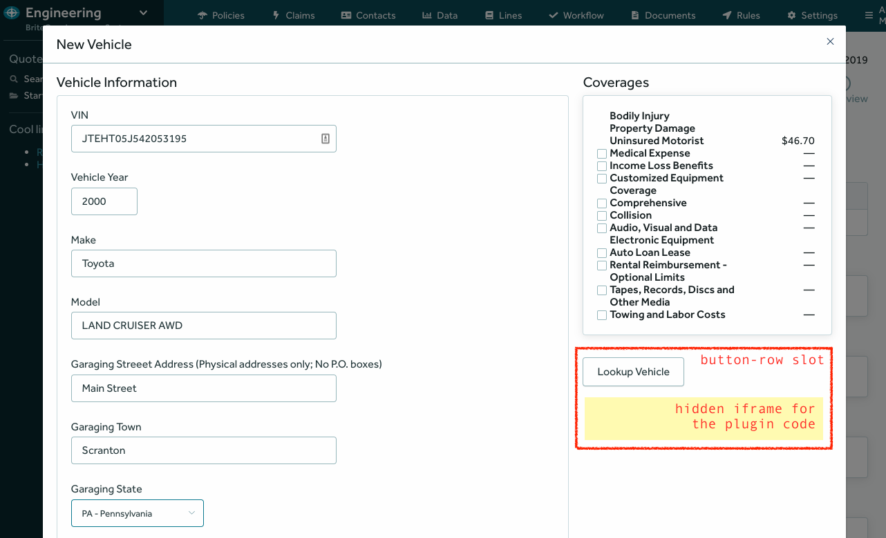
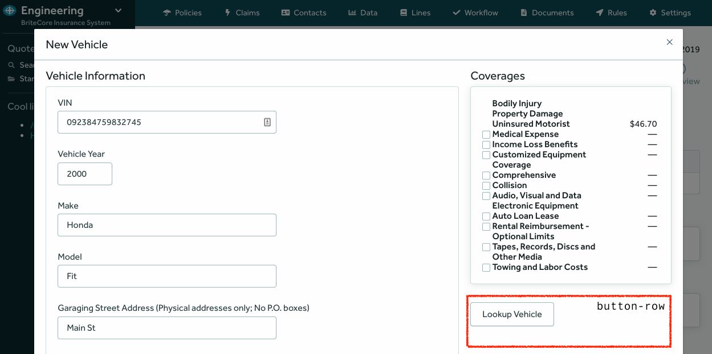
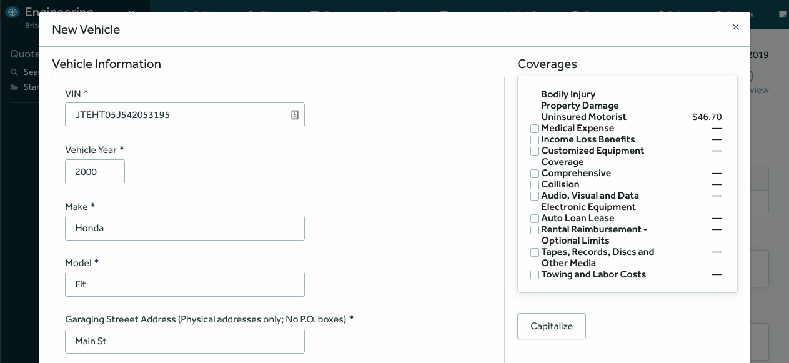

# UI-Plugins-Client Documentation


## Table of Contents

- [Overview](#overview)
- [Plugin Slots](#plugin-slots)
- [Plugin Slots Reference](#plugin-slots-reference)
- [The JS Library](#the-js-library)
- [Writing a new BriteCore Plugin](#writing-a-new-britecore-plugin)
- [References](#references)


## Overview

UI Plugins allow you to add your own functionality to BriteCore without having to
introduce any changes into BriteCore's codebase. To do so, you need to:

1. Find a **Plugin Slot** that supports your functionality.
2. Write a Plugin using the JavaScript library provided here.
3. Register such a Plugin using your carrier's
   [BriteUIPlugins](https://github.com/IntuitiveWebSolutions/BriteUIPlugins) instance.

Keep reading this document in order to get more details on the steps above.


## Plugin Slots

**Plugin Slots** are pre-defined sections of the BriteCore's UI where third-parties can connect their  ```
plugins.

For example, BriteCore provides a plugin slot called `britequote:risk-edit:button-row`,
which lets users add custom action buttons into the quoting form. The screenshot below
highlights the slot itself as well as the hidden iframe where your plugin code is going
to be loaded into:



Each Plugin Slot type may have instances spread in multiple spots in the UI. For example,
the `button-row` slot could be available in different places across the system:

- `britequote:risk-edit:button-row`
- `britelines:risk-edit:button-row`
- `britedocs:edit-form:button-row`

This way, when connecting your plugin to BriteCore you have to specify to which specific
Plugin Slot instance you want to connect.


## Plugin Slots Reference

BriteCore UI offers slots throughout its UI where third party developers can plug their
extensions in.


### button-row

The `button-row` slot allows you to plug in action buttons on various pages.
Such buttons get the form data as a parameter so that they can do computations,
third party services lookups, validations, etc. As a result, they have to send a
[JSON Patch](http://jsonpatch.com/) object specifying which fields in the form they
want to update.

The image bellow shows the slot with an action button on it:




#### Details
- **Slot type:** `button-row`.
- **Slot instances in the UI:** `britequote:risk-edit:button-row`.
- **Interface:** requires an object like this on initialization:

```js
{
  buttons: [{
    text: 'Capitalize',
    callback: capitalizeFields
  }]
}
```

The callback function must be defined in your plugin file and it will be called whenever
the button is clicked.


## The JS Library

BriteCore provides a JavaScript library that you can use to build your plugins.

In order to use it, add this to your plugin HTML file:

```html
<script src="https://d1zol2vqugn1g2.cloudfront.net/britecore-ui-plugins.js"></script>
```

And then you'll be able to use the `BriteCorePlugin` helper so that your plugin can
communicate with BriteCore:

```js
  let p = new BriteCorePlugin()
  p.initialize({
    'slot-name': slotInput
  })
```

The `slotInput` object will vary depending on your need and on the Plugin Slot you want
to connect to. For example, let's say that you want to connect to the `button-row` slot
and send it a single button:

```js
  let p = new BriteCorePlugin()
  p.initialize({
    'button-row': {
      buttons: [{
        text: 'Lookup',
        callback: lookupDetails
      }]
    }
  })
```

The library source code can be found [here](https://github.com/IntuitiveWebSolutions/UI-Plugins-Client/blob/master/src/index.js).

## Writing a new BriteCore Plugin

Writing a new plugin will depend a lot on which type of plugin you want to create. First of
all, there must be an existent [plugin slot](#plugin-slots-reference) that matches these
requirements:

1. There must be a slot instance in the UI spot where you want load your plugin.
2. The slot must allow for the behavior you want your plugin to have.


If you've found a proper slot then you'll have to follow these steps:

1. Creating an HTML file for the plugin code.
2. Uploading the Plugin file and its configuration to a
   [BriteUIPlugins](https://github.com/IntuitiveWebSolutions/BriteUIPlugins) instance.

In order to understand each of the steps, let's dive into an use case: a plugin to add an
action button to capitalize a couple fields in the Quoting form.


### Use case: the Capitalizer plugin

BriteCore UI already provides a slot that allows a third party plugin to render an action button
to execute actions on a quoting form: the [`button-row` slot](#button-row). Now all you have to
do is to write a plugin that follows the contract defined by that slot.


#### 1. Creating the plugin HTML file

BriteCore provides [a simple JS library](#the-js-library) to allow for the creation of third-party
plugins and we are going to use it for our example.

The contract that a plugin has to implement in order to connect to the
[`button-row`](#button-row) slot is quite simple. All you need is to provide a label for
the button and a callback function capable of reading the form fields from a `context`
object and send a JSON Patch object with the changes you want to make to the form data.

Once you include the JS library in your plugin HTML file, you'll be able to use the
`BriteCorePlugin` helper class to connect your plugin to BriteCore via its `initialize`
method.

This is how the Capitalizer plugin would look like:

```html
<html>
  <head>
    <script src="https://cdnjs.cloudflare.com/ajax/libs/lodash.js/4.17.11/lodash.js"></script>
    <script src="https://d1zol2vqugn1g2.cloudfront.net/britecore-ui-plugins.js"></script>

    <script>
      function capitalizeFields (context) {
        let fa = context.field_answers
        const jsonPatch = [
          {op: 'replace', path: '/field_answers/make', value: _.capitalize(fa.make)},
          {op: 'replace', path: '/field_answers/model', value: _.capitalize(fa.model)},
        ]
        this.emit('update-risk', jsonPatch)
      }

      let p = new BriteCorePlugin()
      p.initialize({
        'button-row': {
          buttons: [{
            text: 'Capitalize',
            callback: capitalizeFields
          }]
        }
      })
    </script>
  </head>
</html>
```

Notice that we are initializing the plugin with an object where the keys are the slots that
our plugin needs to interact with and the values are the objects expected during the slot
initialization.

We're just following the specifications from the [button-row](#button-row) contract,
providing an array of objects containing a label and the callback function to handle
the form data and send the JSON Patch object back.

Under the hood, the `BriteCorePlugin` object will start the connection to the plugin slot
and, once that is done, it will emit an initialization event to the slot, sending along the
object with the buttons it wants to be rendered. The slot will be waiting for such an event
and will render the buttons wherever it is placed.


#### 2. Uploading your Plugin to BriteUIPlugins

[BriteUIPlugins](https://github.com/IntuitiveWebSolutions/BriteUIPlugins) is a service
responsible for the registration, configuration and API for third-party plugins and your
new plugin has to be uploaded there in order to work in BriteCore.

Go to your carrier's BriteUIPlugins Django admin UI and add a new **Plugin** instance with
the following data:

- **Name**: `Capitalizer`.
- **Base URL**: leave empty and the correct URL will be automatically set.

Then, add a new **Plugin Slot** instance:

- **Plugin**: select `Capitalizer`.
- **Slot name**: `britequote:risk-edit:button-row`.
- **Plugin file**: upload the plugin HTML file.

That's it, now if you go to the Quoting form, you should be able to interact with the
new button there:




## References

- [BriteUIPlugins repo](https://github.com/IntuitiveWebSolutions/BriteUIPlugins)
